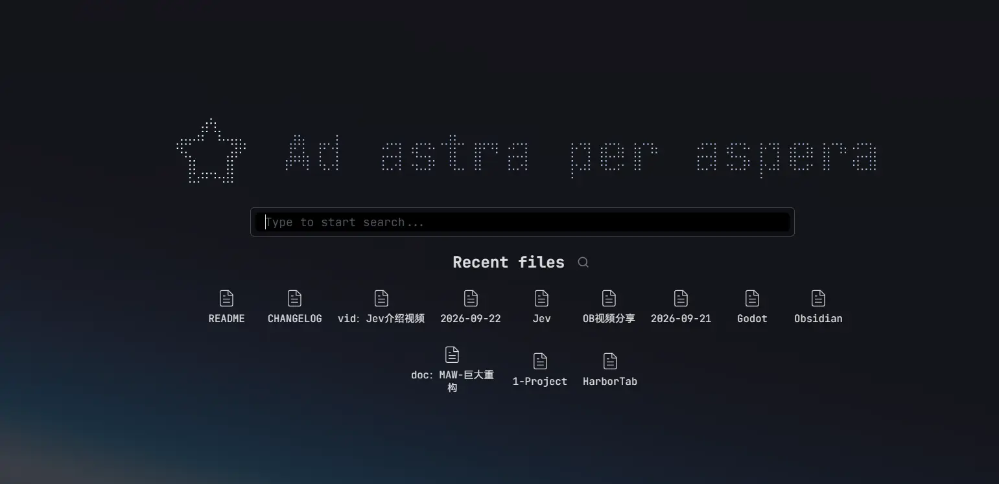
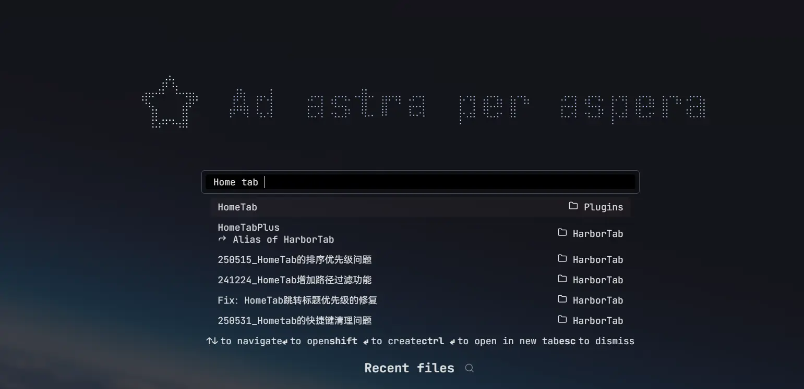
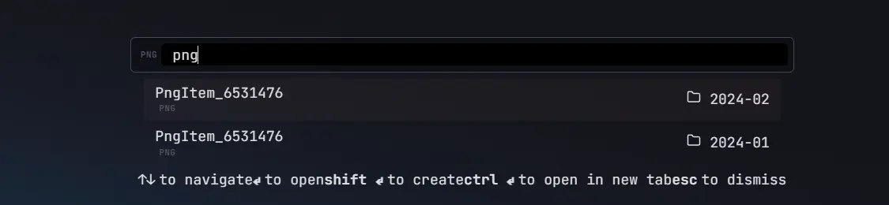
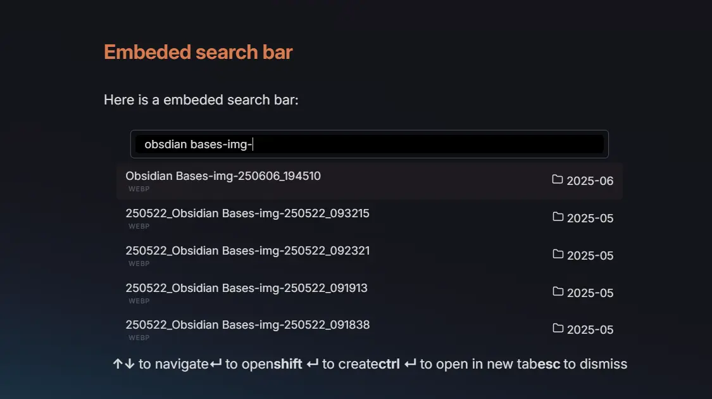

# Harbor Tab


*Your vault's home port.*

Harbor Tab is a modernized continuation of [Home tab](https://github.com/olrenso/Obsidian-home-tab) plugin by [olrenso](https://github.com/olrenso) — an [Obsidian](https://obsidian.md/) plugin that adds a browser-like default new tab with a search bar and a grid of starred files, now with ongoing updates and new features.



You can search any local file in your vault, both markdown notes and attachments.


This plugin is not meant to be a replacement for the default Quick switcher or any alternative one like [Another quick switcher](https://github.com/tadashi-aikawa/obsidian-another-quick-switcher) (from which I took inspiration), but rather a faster way to open a note or a file after opening a new tab.

## What's new
Compared to the original Home tab, this fork continues development with:

- **Heading search & jump** — search through document headings and automatically jump to the matched one, with a smart jump strategy
- **Web link suggestions** — detect web addresses typed in the search bar and offer to open them with the Web Viewer core plugin
- **Localization** — English and Simplified Chinese
- **Particle wordmark** — render the logo and title as an interactive particle grid that ripples around the cursor, with a monochrome mode, ambient idle-motion modes (wave, float, staggered float, heartbeat, ripple, breathe) and tunable canvas parameters
- **Modernized settings tab** — rebuilt on Obsidian's declarative settings API, organized into sub-pages

## How to use
By default, every new empty tab is automatically replaced with the Home tab view. You can disable this behavior in the settings and manually open a new Home tab through the command palette with the commands `Home tab: Open new Home tab` or `Home tab: Replace current tab`.

## Features
### Filter search by file type or extension
To easily find a file you can filter the search by using filters for the file type or the file extension.

You can activate a filter by writing the filter key (see table below) and pressing tab. To remove the filter press backspace.



#### Filters keys
The following filters are available:

| File type | File extension | 
| :-: | :-: | 
| `markdown` | `md`|
| `image` | `png`, `jpg`, `jpeg`, `svg`, `gif`, `bmp` | 
| `video` | `mp4`, `webm`, `ogv`, `mov`, `mkv` |
| `audio` | `mp3`, `wav`, `m4a`, `ogg`, `3gp`, `flac` |
| `pdf` | `pdf` |  
| `canvas` | `canvas` |

### Embedded search bar
You can embed the Home tab view in any note with options to show recent files, starred files, or only the search bar.

To embed the search bar to a note, you have to create a `search-bar` code block (see the following example).

To show only the search bar, without the title and the logo/icon, add (in a new line) `only search bar`.
To show the starred and recent files add, respectively, `show starred files` and `show recent files`.

For example, the following code block will render the search bar and the starred files.
````text
```search-bar
only search bar
show starred files
```
````



---

# How to install
The plugin will be available directly from the [Obsidian plugin browser](https://obsidian.md/plugins?id=harbor-tab).

Alternatively, you can install with [BRAT](https://github.com/TfTHacker/obsidian42-brat) by using the following links: `https://github.com/Moyf/harbor-tab` or `Moyf/harbor-tab`.

---

# Acknowledgments

- Original [Home tab](https://github.com/olrenso/Obsidian-home-tab) plugin by [olrenso](https://github.com/olrenso). ❤️
- Continued development is permitted by the original author — see [olrenso/obsidian-home-tab#65](https://github.com/olrenso/obsidian-home-tab/issues/65) for details.
- The particle wordmark effect is inspired by [Arknights-FlowingPoints](https://github.com/BlackCoder0/Arknights-FlowingPoints) by [BlackCoder0](https://github.com/BlackCoder0) — Our implementation is an independent rewrite of that idea.
