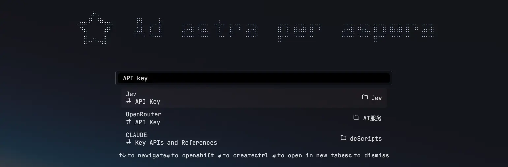
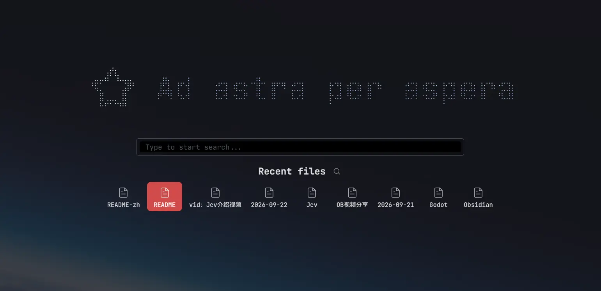
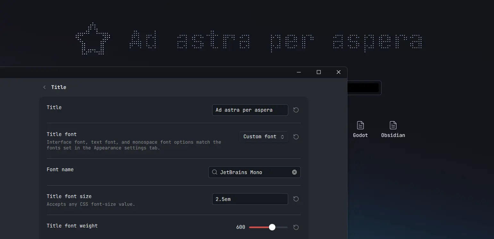
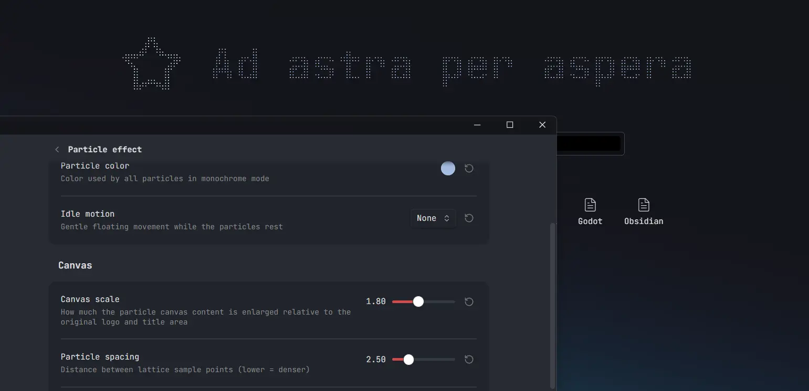

*A harbor for every note.*

# Harbor Tab

English | [中文文档](https://github.com/Moyf/harbor-tab/blob/main/README-zh.md)

   


Harbor Tab is an [Obsidian](https://obsidian.md/) plugin that brings a browser-like home experience to your default new tab, with a search bar, recent notes, bookmarked notes, and more.


> A continuation of the [Home tab](https://github.com/olrenso/Obsidian-home-tab) plugin by [olrenso](https://github.com/olrenso), with ongoing updates and new features built on top of it.

## How to use
Once enabled, every new empty tab is automatically replaced with the Harbor Tab view.
You can disable this behavior in the settings and manually open a new Harbor Tab through the command palette with the commands `Harbor Tab: Open new tab` or `Harbor Tab: Replace current tab`.

## Highlights
### Instant search
You can search any local file in your vault, including markdown notes and attachments.


*Open a new tab, type a note name, press Enter and set sail — like boarding one "note ship" after another in the harbor.*

Worth mentioning —
**besides note names, the plugin also supports searching title properties and any headings inside notes**.



After selecting a result, it jumps straight to the corresponding heading.

### Recent notes
Recently viewed notes are shown below the search bar, so you can quickly pick up where you left off.



Bookmarked notes can likewise be displayed below for quick jumping.

### Custom logo and title
Both the icon and the text above the search box are customizable:


A particle effect can be enabled, turning it into cool, mouse-interactive particles:


### What's new
Compared to the original Home tab, this fork continues development with:

- **Heading search & jump** — search through document headings and automatically jump to the matched one, with a smart jump strategy
- **Web link suggestions** — detect web addresses typed in the search bar and offer to open them with the Web Viewer core plugin
- **Localization** — English and Simplified Chinese
- **Particle wordmark** — render the logo and title as an interactive particle grid that ripples around the cursor
- **Modernized settings tab** — rebuilt on Obsidian's declarative settings API, organized into sub-pages

## Features
### Filter search by file type or extension
To easily find a file you can filter the search by using filters for the file type or the file extension.

You can activate a filter by writing the filter key (see table below) and pressing tab. To remove the filter press backspace.


#### Filter keys
The following filters are available:

| File type | File extension |
| :-: | :-: |
| `markdown` | `md` |
| `image` | `png`, `jpg`, `jpeg`, `svg`, `gif`, `bmp` |
| `video` | `mp4`, `webm`, `ogv`, `mov`, `mkv` |
| `audio` | `mp3`, `wav`, `m4a`, `ogg`, `3gp`, `flac` |
| `pdf` | `pdf` |
| `canvas` | `canvas` |

### Embedded search bar
You can embed the Harbor Tab view in any note with options to show recent files, starred files, or only the search bar.

To embed the search bar to a note, you have to create a `search-bar` code block (see the following example).

To show only the search bar, without the title and the logo/icon, add (in a new line) `only search bar`.
To show the starred and recent files add, respectively, `show starred files` and `show recent files`.
Periodic notes (if enabled in the settings) can be added with `show periodic notes`.

For example, the following code block will render the search bar and the starred files.

````text
```search-bar
only search bar
show starred files
```
````


---

## Installation
The plugin will be available directly from the [Obsidian plugin browser](https://obsidian.md/plugins?id=harbor-tab).

Alternatively, you can install with [BRAT](https://github.com/TfTHacker/obsidian42-brat) by using the following links: `https://github.com/Moyf/harbor-tab` or `Moyf/harbor-tab`.

---

## Acknowledgments

- The original [Home tab](https://github.com/olrenso/Obsidian-home-tab) plugin by [olrenso](https://github.com/olrenso) ❤️
- Continued development is permitted by the original author — see [olrenso/obsidian-home-tab#65](https://github.com/olrenso/obsidian-home-tab/issues/65)
- The particle wordmark effect is inspired by [Arknights-FlowingPoints](https://github.com/BlackCoder0/Arknights-FlowingPoints) by [BlackCoder0](https://github.com/BlackCoder0) — our implementation is an independent rewrite of that idea
- **Background image** is implemented using the [style context](https://github.com/Moyf/style-context) plugin

## Support

If you like Harbor Tab, consider [buying me a coffee on Ko-fi](https://ko-fi.com/moy) ☕

